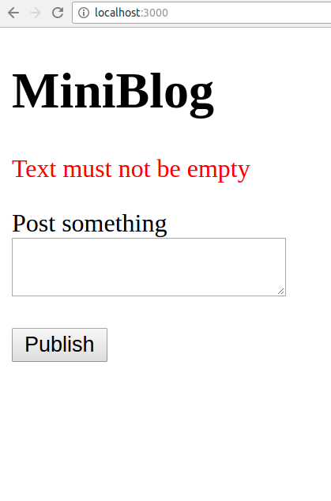
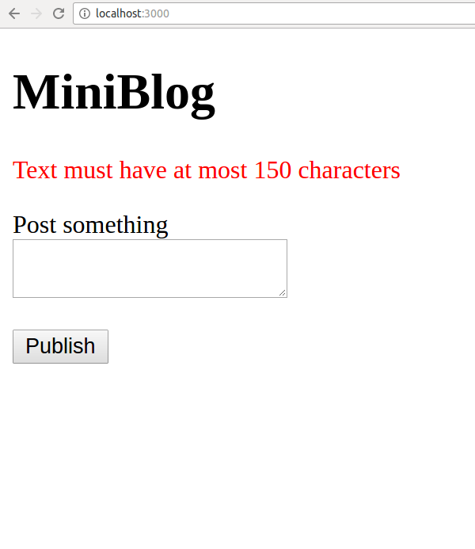
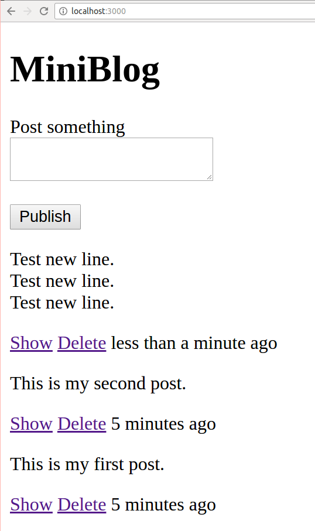
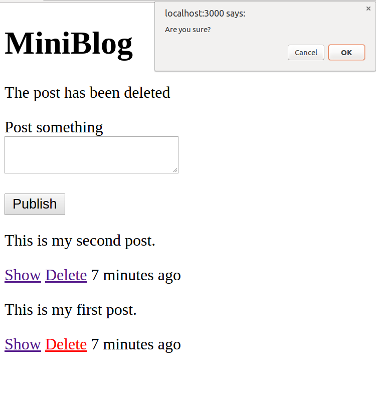
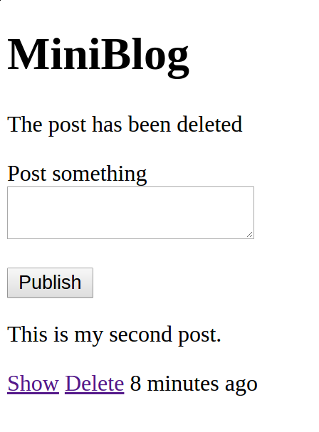
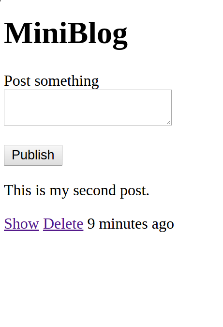

# miniBlog
**miniBlog** is a blog prototype built with Rails 5.0 without using scaffold. Its detailed description can be found [here](https://github.com/madetech/handbook/blob/master/guides/hiring/remote_test/brief.md).
RSpec, shoulda-mathcers and Capybara are used for unit test and feature test. Robocup is used for code style checking.

## Installation
Prerequisite: Ruby on Rails (>4.0), Ruby (> 2.0), Rake.
```
git clone https://github.com/Richard-zhang/miniBlog.git
cd miniBlog
bundle install
```

## Run it
```
cd miniBlog/
rake db:migrate
bin/rails server
```
Open the default browser (suggested: Chrome, Firefox and Safari), and type **localhost:3000** in the address bar.

## Test it
To test all the test cases
```
rspec
```
To run model validation test
```
rspec spec/models/post_spec.rb
```
To run features test
```
rspec spec/features/
```

## Screenshot






